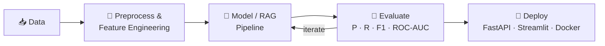

<!-- ═══════════════════════════ HEADER ═══════════════════════════ -->
<!-- Every visual in this README is a hand-built animated SVG in /assets (generators in /tools). -->
<p align="center">
  
</p>

<p align="center">
  <a href="https://linkedin.com/in/tejas-kumar-tech"></a>
  <a href="mailto:tejasprof84@gmail.com"></a>
  <a href="https://hub.docker.com/r/tejas8484/catdog"></a>
  <a href="https://tejasprof84.github.io"></a>
  
</p>


<h2> About Me</h2>



```python
class TejasKumar:
    role       = "AI/ML Engineer  ·  AI Engineer Intern @ Datamites"
    location   = "Bengaluru, India 🇮🇳"
    education  = "B.E. Computer Science — SKIT Bangalore (CGPA 8.3)"
    focus      = ["Generative AI", "RAG & Semantic Search", "Agentic AI", "Computer Vision", "NLP"]
    currently  = "Designing RAG-based document Q&A systems with LangChain, Pinecone & FAISS"
    learning   = ["LangGraph multi-agent systems", "MCP", "Object detection metrics — IoU · NMS · mAP"]
    philosophy = "A model isn't done until it's evaluated honestly and deployed for real users."

    def ask_me_about(self):
        return ["RAG pipelines", "Transfer learning", "Model evaluation", "FastAPI + Docker"]
```

- 🧠 I build **end-to-end ML systems** — data preprocessing → feature engineering → training → rigorous evaluation → deployment.
- 🔎 I care about **grounded AI**: retrieval pipelines that cut hallucinations and cite their sources.
- 📊 I measure what matters — **precision, recall, F1, ROC-AUC, false-negative rate, RMSE** — not just accuracy.
- 📫 Open to **AI/ML, GenAI/Agentic and Computer Vision Engineer** roles.


<h2> Tech Arsenal</h2>

<p align="center">
  
</p>

<table align="center">
<tr><td><b>🤖 Generative AI</b></td><td>


</td></tr>
<tr><td><b>🔎 RAG & Vector Search</b></td><td>


</td></tr>
<tr><td><b>👁️ Computer Vision & DL</b></td><td>


</td></tr>
<tr><td><b>📈 Machine Learning</b></td><td>


</td></tr>
<tr><td><b>🚀 Deploy & MLOps</b></td><td>


</td></tr>
</table>


<h2> Featured Projects</h2>

<p align="center">
  
</p>

<table>
<tr>
<td width="50%" valign="top">

### 🧠 Intelligent RAG Chatbot
End-to-end RAG pipeline that ingests **PDFs, CSVs and live web pages**, indexes embeddings in **Pinecone**, and answers with a **Groq-hosted LLM** via LangChain — streaming chat UI with session analytics and source-grounded answers.

`LangChain` `Pinecone` `Groq` `Streamlit` `BeautifulSoup`

<a href="https://github.com/Tejasprof84/datamites-rag-chatbot"></a>
<a href="https://smart-rag.streamlit.app/"></a>

</td>
<td width="50%" valign="top">

### 🩻 Chest X-Ray Pneumonia Classifier
Transfer learning across **MobileNetV2, EfficientNet-B0, ResNet50**. Diagnosed and fixed majority-class collapse by optimising for **recall, F1 and false-negative rate** — because a missed diagnosis costs the most.

`TensorFlow` `Keras` `OpenCV` `ROC-AUC` `Streamlit`

<a href="https://github.com/Tejasprof84/chest-xray-pneumonia-classifier"></a>
<a href="https://chest-xray-pneumonia-classifier-m9wthzs4ank8kecsvswan8.streamlit.app/"></a>

</td>
</tr>
<tr>
<td width="50%" valign="top">

### 🏥 Healthcare Chatbot (RAG)
End-to-end **AI medical assistant** that answers health questions grounded in trusted medical documents — **FAISS** vector search + **Hugging Face** embeddings + LLM via LangChain, cutting hallucinated answers.

`LangChain` `FAISS` `Hugging Face` `LLMs`

<a href="https://github.com/Tejasprof84/healthcare-chatbot-rag"></a>

</td>
<td width="50%" valign="top">

### 🚨 Autonomous AI Incident Response
AI-powered root-cause analysis platform that detects service failures, **correlates logs, metrics and traces**, and recommends remediation actions.

`AIOps` `LLMs` `Observability` `Python`

<a href="https://github.com/Tejasprof84/autonomous-ai-incident-response"></a>

</td>
</tr>
<tr>
<td width="50%" valign="top">

### 🐱🐶 Cat vs Dog — Transfer Learning
Reusable **model factory** (MobileNetV2 / EfficientNet-B0 / ResNet50) with automated corrupted-file handling, error-analysis visualiser, Streamlit app and a **Docker Hub** image.

`TensorFlow` `Docker` `Streamlit`

<a href="https://github.com/Tejasprof84/Cat-vs-Dog-Image-Classification-using-Transfer-Learning"></a>
<a href="https://cat-vs-dog-image-classification-using-transfer-learning-3v5de8.streamlit.app/"></a>
<a href="https://hub.docker.com/r/tejas8484/catdog"></a>

</td>
<td width="50%" valign="top">

### 🎯 YOLO Object Detection
Detection & localisation pipeline with **Ultralytics YOLO11n** — bounding boxes, class IDs and confidence scores rendered with OpenCV. Now extending with **IoU, NMS and mAP** evaluation.

`PyTorch` `Ultralytics` `OpenCV`

<a href="https://github.com/Tejasprof84/yolo16_object_detection"></a>

</td>
</tr>
</table>

<details>
<summary> <b>More projects</b></summary>
<br>

| Project | What it does | Stack |
|---|---|---|
| [📄 RAG + OCR Document QA](https://github.com/Tejasprof84/RAG_ocr_project) | Q&A over scanned documents using OCR + RAG | OCR · RAG · Python |
| [🏦 Loan Approval Web App](https://github.com/Tejasprof84/LoanApprovalWebAppPrediction) | Predicts loan-approval probability | Flask · scikit-learn |
| [📩 Spam Message Detector](https://github.com/Tejasprof84/spam_message_detector_Nav_bayes_) | Classifies SMS as spam / ham | Naive Bayes · NLP |
| [🏠 House Price Prediction](https://github.com/Tejasprof84/HousepricePrdeiction) | Regression model for house prices | scikit-learn · Pandas |
| [🧩 NeetCode Submissions](https://github.com/Tejasprof84/neetcode-submissions) | DSA practice in Python | Python |

</details>


<h2> Experience</h2>

**AI Engineer Intern — Datamites** &nbsp;·&nbsp; *Nov 2025 – Present*
- Designed and deployed a **RAG-based document search & Q&A system** (LangChain, Pinecone, FAISS) that surfaces context-grounded answers from large document sets.
- Built preprocessing & feature-engineering pipelines with structured evaluation across **ML, DL, NLP, CV and GenAI** projects.


<h2> GitHub Analytics</h2>

<p align="center">
  
</p>


<h2> Models in Action</h2>

<p align="center">
  
</p>

<p align="center">
  
</p>


<h2> How I Build</h2>




<p align="center">
   <i>"Retrieve the right context, measure honestly, ship to real users."</i>
</p>

<p align="center">
  
</p>
